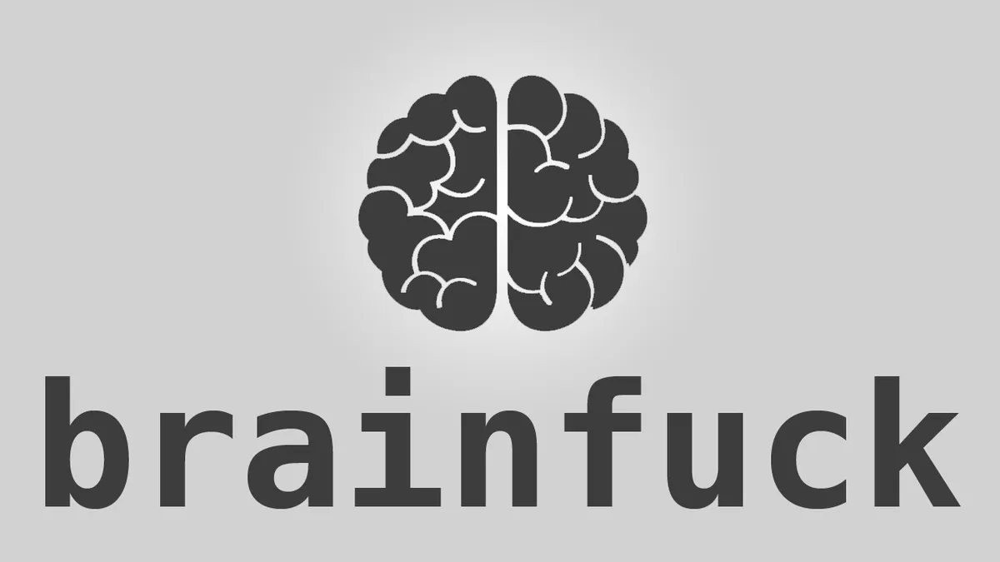

# Brainfuck


<p align="center" margin="6px">
    <a href="https://github.com/vilayat-ali/Brainfuck/graphs/contributors" alt="Contributors">
        
    </a>
    <a href="https://github.com/vilayat-ali/Brainfuck/pulse" alt="Activity">
        
    </a>
</p> 

## Hello, Visitor!
Hey there, welcome to my project showcase website! It's great to have you here. I hope you're ready to check out some awesome projects that I've been working on. Take a look around, explore the different projects and feel free to leave comments or feedback. I'm always open to new ideas and suggestions. If you want to see more of my work, head over to my Github repo at https://www.github.com/vilayat-ali. There you'll find even more projects, code snippets, and experiments that I've been tinkering with. Thanks for stopping by, and I hope you enjoy browsing my projects as much as I enjoyed creating them!

## Inspiration
Welcome to my website where I will share with you the story of how I got inspired to create an interpreter for the Brainfuck programming language using the Rust programming language.

As a computer science student, I've always been interested in programming languages and how they work. When I first came across Brainfuck, I was intrigued by its simplicity and the challenge of working with such a limited set of commands.

I was inspired to create an interpreter for Brainfuck in Rust after reading a blog post by Alastair Reid, where he explained how he built an interpreter for the same language in Haskell. His post showed me that it was possible to build a powerful interpreter for Brainfuck using functional programming concepts, and I wanted to see how I could apply those same concepts to Rust.

I also drew inspiration from the book Programming Rust: Fast, Safe Systems Development" by Jim Blandy and Jason Orendorff. The book provided a comprehensive overview of the Rust language and its capabilities, which helped me understand how to build a performant and reliable interpreter.

But most importantly, I got inspired by Fireship's youtube video titled, "Brainf**k in 100 Seconds", where he explains all language features and mechanics that set me off and made me keep going.

I love videos by Fireship! My man, makes the best programming-related content, that are, apart from being very infomative are fun to watch too. This video is way more favourite to me than his any other video, for the reason that it was the resource that introduced me to the Brainfuck programming language, in the very first place.

The project was a challenging and rewarding experience, and I'm excited to share it with you on this website

I hope my journey inspires you to explore new programming languages and concepts.

## About Brainfuck
Brainfuck is a programming language that was invented by Urban Müller in 1993. Despite being one of the most minimalist programming languages ever created, Brainfuck has maintained a small but dedicated following of programmers who find it to be a challenging and rewarding language to work with.

<figure>
<p align="center">

<figcaption align = "center"><b>Urban Muller - Inventor of Brainfuck</b></figcaption>
</p>
</figure>

Urban Müller, the inventor of Brainfuck programming langauge.
The language is based on a simple idea: the program operates on a tape of memory cells, each of which can store a single byte. The program also has a data pointer that can move along the tape, allowing the program to read and write values to and from memory. Brainfuck consists of only eight commands, each represented by a single character. The commands are:

- '>' increment the data pointer
- '<' decrement the data pointer
- '+' increment the value at the data pointer
- '-' decrement the value at the data pointer
- '.' output the value at the data pointer as a character
- ',' input a character and store it at the data pointer
- '[' if the value at the data pointer is zero, jump to the corresponding ']'
- ']' if the value at the data pointer is not zero, jump to the corresponding '['

While Brainfuck is undoubtedly one of the most challenging languages to learn and write in, it has maintained a dedicated following of programmers who find it to be a fun and interesting way to learn about programming concepts.

Brainfuck was initially created by Müller as a language to challenge programmers to think about programming in a different way. He was inspired by the Turing machine, an abstract machine that can simulate any computer algorithm. In a similar vein, Brainfuck is a Turing-complete language, which means that it can simulate any other computer algorithm.

While Brainfuck never gained mainstream popularity, it has maintained a small but dedicated following of programmers who find it to be a fun and interesting way to learn about programming concepts. In recent years, there has been something of a comeback for Brainfuck, with new interpreters and compilers being developed and used for everything from coding challenges to art installations. One of the most popular Brainfuck interpreters is written in C by Daniel B. Cristofani, and it is available on his website.

There are also several online Brainfuck interpreters available, as well as plugins for popular code editors like Visual Studio Code.

In conclusion, while Brainfuck may not be the most practical language for most programming tasks, it has maintained a small but dedicated following of programmers who find it to be a fun and interesting way to learn about programming concepts. As new interpreters and compilers are developed, it's likely that we'll see Brainfuck continue to be used for creative and challenging programming projects.

## Usage
### Method 1: Cloning and building the repo
Clone the repo by running the following command in your terminal:

`git clone -b main https://github.com/Vilayat-Ali/Brainfuck.git vilayat-brainfuck`

Now cd into the newly generated folder by running

`cd vilayat-brainfuck`

Compiler the code by running the following command in the root of the new folder:

`cargo build --release`

Go to `target/release` folder and extract the executable file named 'brainfuck'

Write a new brainfuck program into a new file:

Sample for hello world - 

```
>++++++++[<+++++++++>-]<.>++++[<+++++++>-]<+.+++++++..+++.>>++++++[<+++++++>-]<+
+.------------.>++++++[<+++++++++>-]<+.<.+++.------.--------.>>>++++[<++++++++>-
]<+.
```

And save it as `helloworld.bf`

Now, run the program by running,

`./brainfuck run <path/to/brainfuck_source_file>` or in this case `./brainfuck run ./helloworld.bf`


### Method 2: Downloading executable from the website

Go to vilayat-brainfuck website's [download page](https://vilayat-ali.github.io/vilayat-ali/Brainfuck/download.html).

Choose the suitable executable and download it.

Write a new brainfuck program into a new file:

Sample for hello world - 

```
>++++++++[<+++++++++>-]<.>++++[<+++++++>-]<+.+++++++..+++.>>++++++[<+++++++>-]<+
+.------------.>++++++[<+++++++++>-]<+.<.+++.------.--------.>>>++++[<++++++++>-
]<+.
```

And save it as `helloworld.bf`

Now, run the program by running,

`./brainfuck run <path/to/brainfuck_source_file>` or in this case `./brainfuck run ./helloworld.bf`
